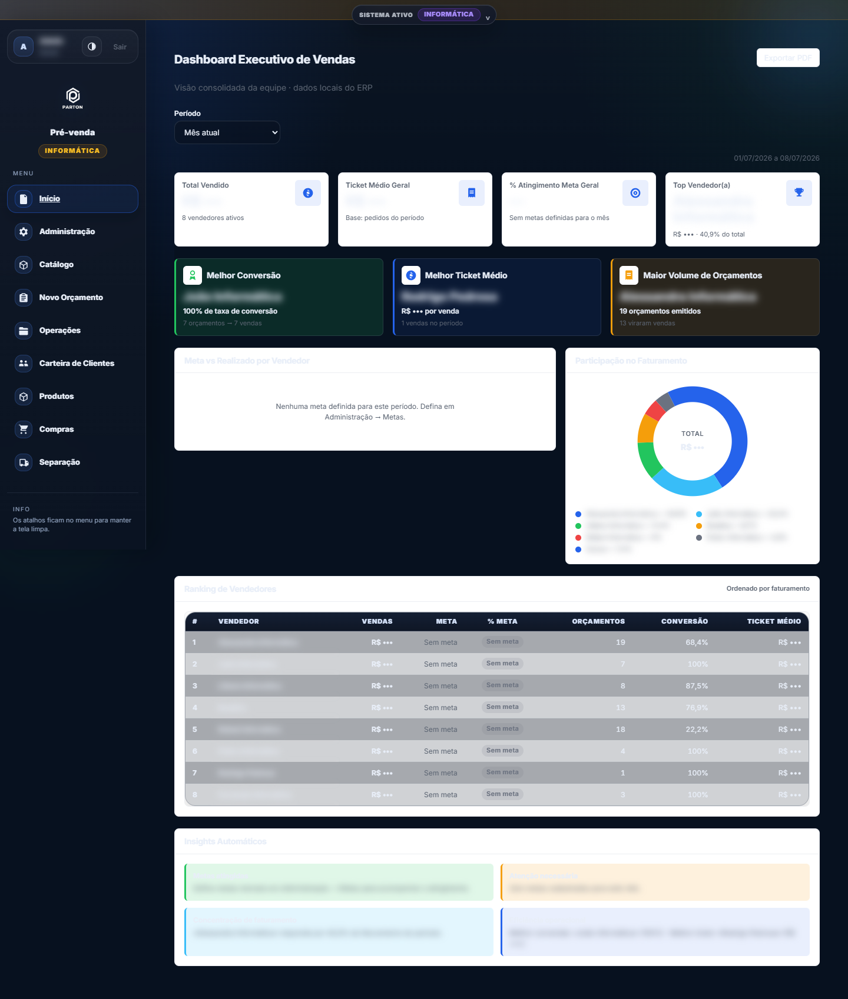
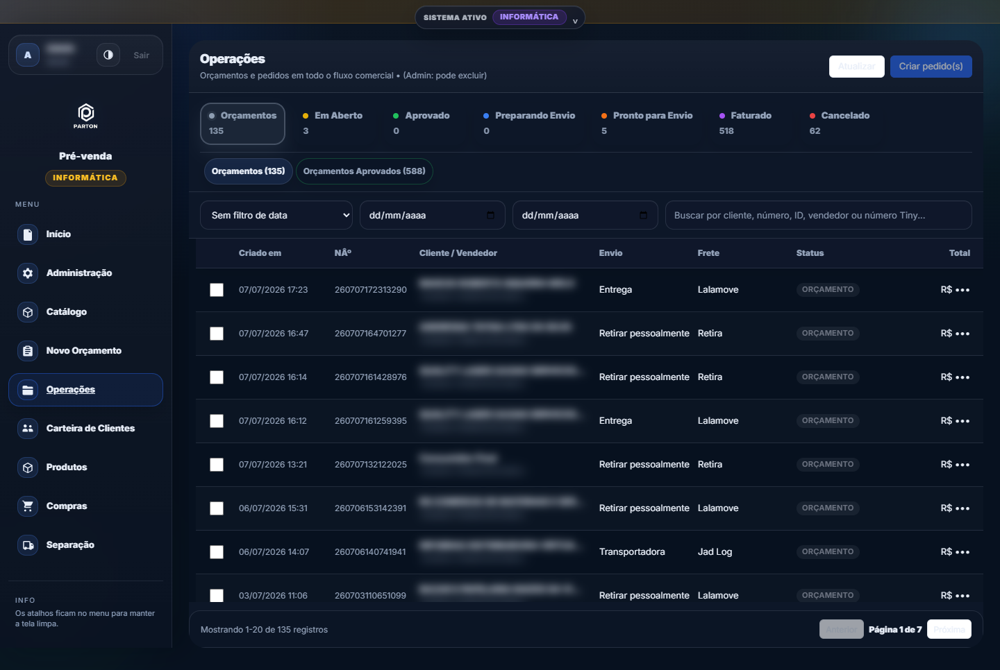
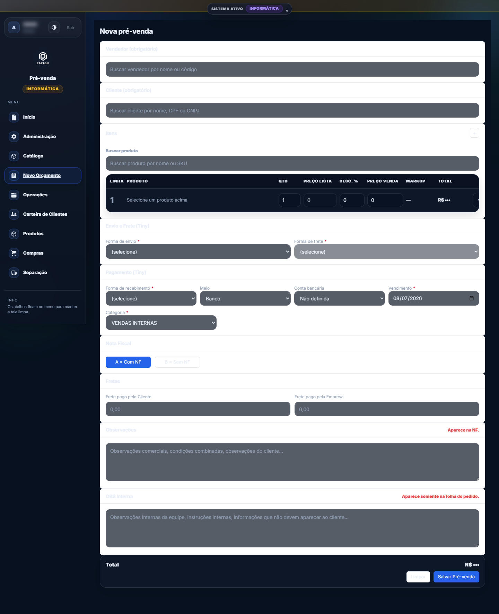
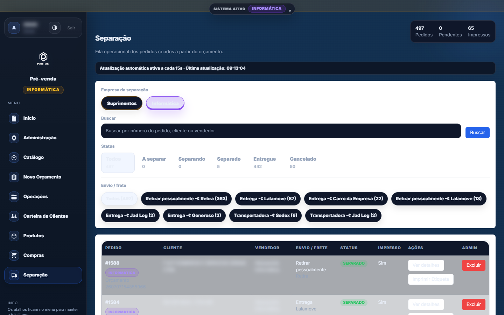
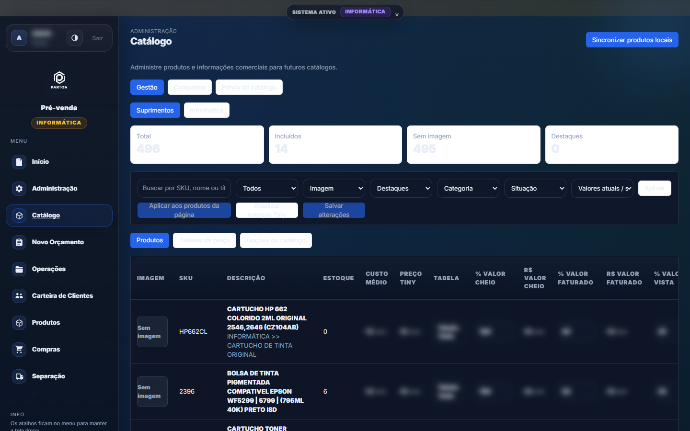

# P&P ERP — Pré-venda, Pedidos e Expedição Multiempresa

> Sistema web de pré-venda, pedidos e expedição para o ciclo de venda B2B — operando duas empresas do grupo sobre uma única base de código, integrado ao Tiny ERP (Olist).

---

## Sobre

Sistema desenvolvido para resolver um problema real de operação comercial: o Tiny ERP (Olist) cobre o faturamento, mas não atende bem à etapa de **pré-venda** — orçamentos com regras de desconto, visão de carteira por vendedor, metas, separação de pedidos e controle do que cada perfil pode ver.

O P&P ERP assume essa camada: vendedores criam e negociam orçamentos com snapshot imutável do cliente e dos produtos, convertem em pedido diretamente no Tiny, e a expedição acompanha a separação com fotos e conferência. Administradores têm dashboard executivo, metas por vendedor e visão de custo/margem — campos que **nunca** chegam ao navegador de um vendedor comum, pois o filtro é imposto na API, não no frontend.

O sistema é **multiempresa**: atende duas empresas do grupo (segmentos de suprimentos e informática), com catálogos, vendedores, tokens de integração e permissões isolados por empresa, e troca de contexto direto na interface.

**Sobre a autoria**: todo o código da aplicação é autoral — não é fork nem white-label de ERP existente. As dependências são bibliotecas open-source de mercado (FastAPI, React, psycopg2, google-cloud-bigquery, jsPDF etc.).

## Stack

| Camada | Tecnologias |
|---|---|
| Backend | Python, FastAPI, Uvicorn, Pydantic |
| Banco (local) | PostgreSQL (schema `erp`, DDL idempotente no startup) |
| Banco (produção) | Google BigQuery (Cloud Run) |
| Frontend | React 19, Vite 7, JavaScript puro (sem TypeScript) |
| Autenticação | JWT + PBKDF2 (local) / Firebase Auth com Google (produção) |
| Integrações | Tiny ERP API v2 (token) e v3 (OAuth 2.0), Olist |
| PDF / impressão | jsPDF + html2canvas |
| Automação | Playwright (automação opcional da UI do Olist) |
| Infra | Docker, Cloud Run, Firebase Hosting (multi-target), Jenkins (CI) |

## Arquitetura

Monorepo com backend duplo: o **mesmo produto** roda localmente sobre PostgreSQL e em produção sobre BigQuery, com paridade de rotas (cerca de 140 endpoints no backend local, cada um registrado com e sem prefixo `/api`).

```
                      ┌───────────────────────────────┐
                      │   Frontend React 19 + Vite    │
                      │   frontend/src (pages/, ui/)  │
                      └───────────────┬───────────────┘
                                      │ REST/JSON (frontend/src/api.js)
               ┌──────────────────────┴──────────────────────┐
               │                                             │
 ┌─────────────▼──────────────┐              ┌───────────────▼───────────────┐
 │  backend/local_api.py      │              │  backend/api.py               │
 │  FastAPI · porta 3002      │              │  FastAPI · Cloud Run (8080)   │
 │  PostgreSQL (schema erp)   │              │  Google BigQuery              │
 │  JWT + PBKDF2              │              │  Firebase Auth                │
 └─────────────┬──────────────┘              └───────────────┬───────────────┘
               │                                             │
               └──────────────────────┬──────────────────────┘
                                      │ backend/tiny_client.py
                       ┌──────────────▼───────────────┐
                       │  Tiny ERP / Olist            │
                       │  API v2 (token) + v3 (OAuth) │
                       └──────────────────────────────┘
```

Pontos de interesse no código:

- `backend/local_api.py` — backend local completo (~17,7 mil linhas): autenticação, regras de negócio, orçamentos, separação, catálogo, estoque, carteira de clientes, metas e sincronização com o Tiny.
- `backend/api.py` — variante de produção (~9,5 mil linhas) sobre BigQuery, com camada própria de cache e sincronismo de separação via API v3.
- `backend/tiny_client.py` — cliente das APIs v2 e v3 do Tiny com retry, backoff exponencial e tratamento explícito de rate limit ("API Bloqueada" / excesso de acessos).
- `frontend/src/pages/` — páginas da aplicação: `Home.jsx` (dashboard), `ExecutiveDashboard.jsx`, `NewQuote.jsx`, `SavedQuotes.jsx`, `Separation.jsx`, `ClientWallet.jsx`, `Catalog.jsx`, `Products.jsx`, `Compras.jsx`, `AdminUsers.jsx`, `AdminSalesTargets.jsx`, entre outras.
- `frontend/src/components/QuotesModal.jsx` — modal de edição de orçamento, núcleo do fluxo operacional.
- `frontend/src/utils/quotePrint.js` — geração do orçamento em PDF para envio ao cliente.
- O build do frontend (`frontend/dist`) é servido pelo próprio backend como SPA.

Tabelas principais (schema `erp`): `companies`, `quotes`, `quote_items`, `separation_orders`, `users`, `user_companies`, `user_audit_log`. Não há framework de migração — o schema evolui por DDL idempotente (`CREATE TABLE IF NOT EXISTS` / `ADD COLUMN IF NOT EXISTS`) executado no startup.

## Funcionalidades principais

**Orçamentos e pedidos**
- Criação, edição, clonagem e listagem de orçamentos com **snapshot em JSONB do cliente, do vendedor e de cada produto** no momento da venda (`client_snapshot`, `seller_snapshot`, `sku/name/product_snapshot`) — o histórico não muda se o cadastro mudar depois.
- Limite de desconto configurável (`MAX_DISCOUNT_PCT`) validado no backend.
- Conversão do orçamento em pedido no Tiny, com aprovação, cancelamento e marcação de faturamento refletidos nos dois sistemas.
- Impressão do orçamento em PDF (jsPDF + html2canvas) com parcelas e condições.

**Sincronização com o Tiny**
- Sync de status de pedidos manual ou em background (worker em thread com endpoint de progresso).
- Cliente HTTP com retry e **backoff exponencial limitado a 60s ao detectar rate limit** da API do Tiny.
- Campos de rastreio por orçamento: `tiny_status_synced_at`, `tiny_status_sync_error`, `tiny_status_raw`.
- Fluxo OAuth 2.0 completo para a API v3 (URL de autorização, callback e gestão de credenciais na área admin).

**Controle de acesso**
- Papéis admin / vendedor / separação. Custo, margem e resultado bruto são **filtrados na API** — nunca apenas ocultados no frontend.
- Autenticação local com JWT e senha em PBKDF2 (210 mil iterações por padrão); em produção, Firebase Auth com Google.
- Vínculo usuário ↔ vendedor do Tiny por empresa e log de auditoria (`user_audit_log`).

**Dashboards e gestão**
- Dashboard do vendedor com filtro de período, gráfico dos últimos 7 dias e detalhamento por hora; filtro por vendedor e métricas financeiras restritos a admin.
- Dashboard executivo (`ExecutiveDashboard.jsx`) e metas mensais por vendedor (`AdminSalesTargets.jsx`).

**Carteira de clientes**
- Carteira por vendedor com sincronização diária agendada (thread com fuso America/Sao_Paulo), últimas compras e último preço praticado por produto.
- Consulta de débitos do cliente (contas a receber no Tiny) com **cache em memória com TTL** para não estourar o rate limit.

**Separação e expedição**
- Fila de separação de pedidos com upload de fotos e etapa de conferência atrás de feature flag (`ENABLE_SEP_CONFERENCIA`).
- Sincronismo de situação da separação via API v3 do Tiny/Olist.

**Catálogo, estoque e compras**
- Catálogo local de produtos com importação do Tiny, detecção de conflitos de SKU, tabelas de preço, campanhas e layouts de catálogo com preview.
- Movimentações locais de estoque com reserva, saída e estorno vinculados a pedidos.
- Consulta de pedidos de compra e atualizações de estoque (fornecedores) via Tiny.

## Como rodar

> Pré-requisitos: Python 3.11+, Node 20+, PostgreSQL local.

**Backend local (PostgreSQL, porta 3002)**

```bash
cd backend
python -m venv .venv && source .venv/bin/activate   # Windows: .venv\Scripts\activate
pip install -r requirements.txt psycopg2-binary      # psycopg2 é instalado à parte
cp ../.env.example ../.env                           # preencher valores localmente
python -m uvicorn local_api:app --host 0.0.0.0 --port 3002
```

**Frontend**

```bash
cd frontend
npm install
npm run dev      # desenvolvimento (Vite)
npm run build    # gera dist/, servido pelo próprio backend
```

**Variáveis de ambiente** (apenas nomes — ver `.env.example`):

- PostgreSQL: `PGHOST`, `PGPORT`, `PGDATABASE`, `PGUSER`, `PGPASSWORD`
- Tiny v2: `TINY_TOKEN` (obrigatória — o backend não sobe sem ela)
- Tiny v3 / OAuth: `TINY_V3_CLIENT_ID`, `TINY_V3_CLIENT_SECRET`, `TINY_V3_ACCESS_TOKEN` e demais `TINY_V3_*`
- Produção: `GCP_PROJECT_ID`, `BQ_DATASET_ID`, `BQ_LOCATION`
- Autenticação e regras: `ERP_LOCAL_AUTH_JWT_SECRET`, `ERP_LOCAL_AUTH_TOKEN_TTL_HOURS`, `ADMIN_EMAILS`, `ALLOWED_EMAILS`, `EXPEDITION_EMAILS`, `MAX_DISCOUNT_PCT`
- Frontend (Firebase, opcional — sem elas o app roda em modo de login local): `VITE_FB_API_KEY`, `VITE_FB_AUTH_DOMAIN`, `VITE_FB_PROJECT_ID`, `VITE_FB_APP_ID`

**Produção**: o backend de produção (`backend/api.py`) roda em container (`backend/Dockerfile`, base Playwright) no Cloud Run, sobre BigQuery; o frontend pode ser publicado no Firebase Hosting (`frontend/firebase.json`, multi-target). O deploy contínuo é feito por pipeline Jenkins (arquivo mantido fora do repositório por conter configuração de infraestrutura).

> Nota honesta: não há suíte de testes automatizados — a validação é feita por `py_compile`, build do frontend e verificação funcional manual, com scripts de diagnóstico em `scripts/` e `tools/`.

## Screenshots

> Capturas do sistema em produção. Dados sensíveis (valores, nomes de clientes/vendedores, custo e margem) foram borrados propositalmente.

**Dashboard executivo de vendas** — KPIs, ranking de vendedores, participação no faturamento e insights automáticos (visão admin):

<p align="center">
  
</p>

**Operações** — listagem de orçamentos e pedidos com abas por status comercial:

<p align="center">
  
</p>

**Novo orçamento** — formulário de pré-venda (cliente, itens, envio/frete, pagamento, NF):

<p align="center">
  
</p>

**Separação** — fila de expedição por empresa, status e forma de envio:

<p align="center">
  
</p>

**Catálogo** — gestão de produtos com colunas financeiras restritas a admin:

<p align="center">
  
</p>
